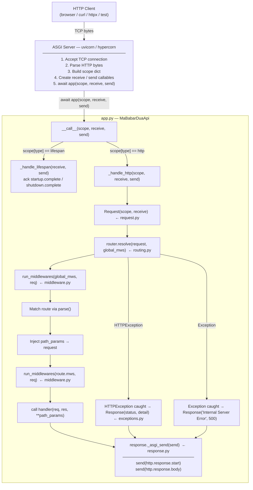
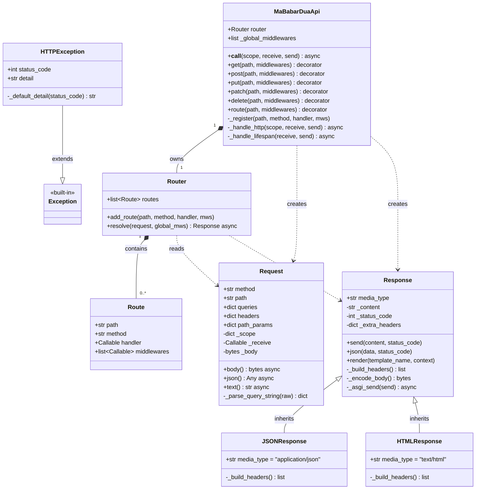

# MaBabarDuaApi

[](https://github.com/abrarshakhi/mababar-dua-api/actions/workflows/tests.yml)
[](https://pypi.org/project/mababar-dua-api/)
[](https://pypi.org/project/mababar-dua-api/)
[](https://opensource.org/licenses/MIT)

ASGI Python web framework.

## Installation

```bash
pip install mababar-dua-api
```

To run a server you also need an ASGI server:

```bash
pip install "mababar-dua-api[dev]"   # installs uvicorn + test deps
```

## Quick Start

```python
from mababar_dua_api import MaBabarDuaApi, JSONResponse

app = MaBabarDuaApi()

@app.get("/")
def index(req, res):
    res.send("Hello, World!")

@app.get("/users/{id}")
def get_user(req, res, id):
    res.json({"id": id})

@app.post("/users")
async def create_user(req, res):
    body = await req.json()
    res.json(body, status_code=201)
```

Run with uvicorn:

```bash
uvicorn myapp:app --reload
```

## Features

- **Async-first** — built on the ASGI protocol, compatible with uvicorn / hypercorn
- **Familiar decorator API** — `@app.get()`, `@app.post()`, `@app.put()`, `@app.patch()`, `@app.delete()`
- **Class-based views** — `@app.route()` scans a class for HTTP method handlers
- **Path parameters** — `/users/{id}`, `/items/{name}/{color}`
- **Query string parsing** — `req.queries["key"]`
- **Async body / JSON** — `await req.body()`, `await req.json()`
- **Response helpers** — `res.send()`, `res.json()`, `res.render()` (HTML templates)
- **Return-style responses** — handlers can return `JSONResponse(...)` or `HTMLResponse(...)`
- **Middleware** — global and per-route, sync or async
- **Exception handling** — `HTTPException(status_code, detail)`, automatic 404 and 500

## Routing

```python
@app.get("/items")
def list_items(req, res):
    res.send("all items")

@app.get("/items/{id}")
def get_item(req, res, id):
    res.json({"id": id})

# Class-based view
@app.route("/orders")
class Orders:
    def get(req, res):
        res.send("list orders")

    def post(req, res):
        res.send("create order", 201)
```

## Middleware

```python
def log(req):
    print(f"[{req.method}] {req.path}")

async def auth(req):
    if not req.headers.get("authorization"):
        from mababar_dua_api import HTTPException
        raise HTTPException(401)

# Global middleware runs on every request
app = MaBabarDuaApi(middlewares=[log])

# Per-route middleware
@app.get("/secret", middlewares=[auth])
def secret(req, res):
    res.send("shh")
```

## Request

| Attribute / Method | Description |
|---|---|
| `req.method` | HTTP method (`"GET"`, `"POST"`, …) |
| `req.path` | URL path (`"/users/42"`) |
| `req.queries` | Parsed query string dict |
| `req.headers` | Lowercase header dict |
| `req.path_params` | Path parameter dict set by router |
| `await req.body()` | Raw request body as `bytes` |
| `await req.json()` | JSON-decoded request body |
| `await req.text()` | Body decoded as UTF-8 string |

## Response

| Method | Description |
|---|---|
| `res.send(text, status_code=200)` | Plain text response |
| `res.json(data, status_code=200)` | JSON response |
| `res.render(template_name, context)` | Render `<name>.html` template |
| `return JSONResponse(data)` | Return-style JSON response |
| `return HTMLResponse(html)` | Return-style HTML response |

## Development

```bash
# clone and install in editable mode
pip install -e ".[dev]"

# run tests
pytest -v

# run the example app
uvicorn example.main:app --reload
```

## License

MIT

---

# Architecture & Internals

This section explains every design decision, every data flow, and every line of the framework from the ground up.

---

## 1. Why This Framework Exists: WSGI vs ASGI

### WSGI — the synchronous predecessor

WSGI (Web Server Gateway Interface, PEP 3333). A WSGI app is a single callable.

```python
def app(environ, start_response):
    start_response("200 OK", [("Content-Type", "text/plain")])
    return [b"Hello"]
```

The fatal constraint is that this is **synchronous and blocking**. When your handler awaits a database query, the OS thread is parked — it cannot serve another request until the I/O completes. To handle N concurrent requests you need N threads. Threads are expensive (stack memory, context-switch cost), so WSGI servers cap concurrency at tens to low hundreds.

### ASGI — the async successor

ASGI (Asynchronous Server Gateway Interface) replaces the blocking callable with an async coroutine:

```python
async def app(scope, receive, send):
    await send({"type": "http.response.start", "status": 200, "headers": [...]})
    await send({"type": "http.response.body", "body": b"Hello"})
```

Python's event loop runs this coroutine. When the coroutine hits an `await`, the event loop suspends it and runs *another* waiting coroutine. One OS thread can handle thousands of concurrent connections because no thread is ever blocked — they all yield voluntarily at `await` points.

### The key differences

|                        | WSGI                          | ASGI                              |
|------------------------|-------------------------------|-----------------------------------|
| Protocol               | Synchronous                   | Asynchronous (async/await)        |
| Handler signature      | `(environ, start_response)`   | `async (scope, receive, send)`    |
| Concurrency model      | Thread-per-request            | Event loop, cooperative coroutines|
| Long-lived connections | Difficult (needs threads/greenlets) | Native (WebSocket, SSE)       |
| I/O while waiting      | Thread sits idle              | Event loop serves other requests  |
| Python servers         | gunicorn, uWSGI               | uvicorn, hypercorn, daphne        |

---

## 2. The ASGI Protocol Explained

Every ASGI framework, including this one, is built on three primitives that the ASGI server provides.

### `scope` — connection metadata

A plain Python `dict` describing the current connection. Its contents depend on `scope["type"]`.

For HTTP requests:

```python
scope = {
    "type": "http",
    "asgi": {"version": "3.0"},
    "http_version": "1.1",
    "method": "GET",                      # uppercased HTTP verb
    "path": "/users/42",                  # decoded URL path
    "query_string": b"verbose=true",      # raw bytes — NOT decoded
    "headers": [                          # list of (bytes, bytes) tuples
        (b"host", b"localhost:8000"),
        (b"authorization", b"Bearer token"),
        (b"content-type", b"application/json"),
    ],
    "root_path": "",
    "scheme": "http",
    "server": ("127.0.0.1", 8000),
}
```

For the lifespan protocol (server startup/shutdown):

```python
scope = {"type": "lifespan", "asgi": {"version": "3.0"}}
```

The scope is read-only data — the framework reads it once per request at construction time.

### `receive` — incoming events

An async callable that the framework calls to read incoming data. For HTTP:

```python
event = await receive()
# During request body streaming:
# {"type": "http.request", "body": b"chunk...", "more_body": True}
# Last chunk:
# {"type": "http.request", "body": b"last chunk", "more_body": False}
# If client disconnects early:
# {"type": "http.disconnect"}
```

The framework must loop until `more_body` is `False` to collect the complete body.

### `send` — outgoing events

An async callable the framework calls to write the response. HTTP responses require **exactly two** `send` calls, in this exact order:

```python
# 1. Status line + headers (must come first)
await send({
    "type": "http.response.start",
    "status": 200,
    "headers": [
        (b"content-type", b"text/plain; charset=utf-8"),
        (b"content-length", b"5"),
    ],
})

# 2. Body (must come after start)
await send({
    "type": "http.response.body",
    "body": b"Hello",
    "more_body": False,    # optional, defaults to False
})
```

**Why are headers bytes?** The ASGI spec follows the HTTP/1.1 wire format where headers are byte sequences encoded in ISO-8859-1 (latin-1). The framework encodes Python strings to bytes using `latin-1` in `_build_headers()`.

### Lifespan events

Before serving any HTTP requests, the ASGI server sends a `lifespan.startup` event. The app must acknowledge it before the server starts accepting connections. On shutdown, the server sends `lifespan.shutdown` and waits for the acknowledgment before exiting.

```python
# Server sends:  {"type": "lifespan.startup"}
# App replies:   {"type": "lifespan.startup.complete"}
# ... serve requests ...
# Server sends:  {"type": "lifespan.shutdown"}
# App replies:   {"type": "lifespan.shutdown.complete"}
```

If the app doesn't handle lifespan, uvicorn logs warnings. The framework handles it silently in `_handle_lifespan()`.

---

## 3. Overall Architecture



---

## 4. Class Diagram



---

